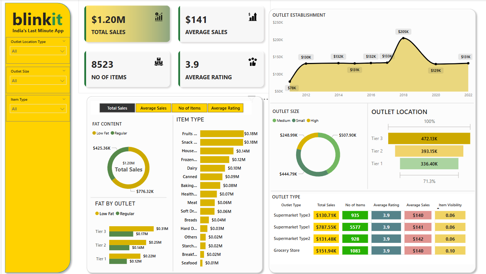

# 📊  blinkit-Dashboard

This Power BI project is a data-driven business intelligence solution developed to analyze and visualize supermarket sales data. It helps uncover insights related to product sales, outlet performance, and customer trends using powerful visualizations and interactive charts.

---

## 🔧 Tools Used

- **Power BI** – Data modeling, visualization, dashboard creation  
- **SQL** – Data extraction, transformation, and aggregation  
- **Python** – Data cleaning and manipulation  
- **Excel** – Initial data exploration and formatting  

---

## 📈 Business Requirements & Chart Objectives

This report was built based on the following analytical requirements:

### 1. **Total Sales by Fat Content**  
- **Objective**: Analyze the impact of fat content on total sales.  
- **KPI Metrics**: Total Sales, Average Sales, Number of Items, Average Rating  
- **Chart Type**: Donut Chart

### 2. **Total Sales by Item Type**  
- **Objective**: Identify the performance of different item types in terms of total sales.  
- **KPI Metrics**: Total Sales, Average Sales, Number of Items, Average Rating  
- **Chart Type**: Bar Chart

### 3. **Fat Content by Outlet for Total Sales**  
- **Objective**: Compare total sales across different outlets segmented by fat content.  
- **KPI Metrics**: Total Sales, Average Sales, Number of Items, Average Rating  
- **Chart Type**: Stacked Column Chart

### 4. **Total Sales by Outlet Establishment Year**  
- **Objective**: Evaluate how the age or type of outlet establishment influences total sales.  
- **Chart Type**: Line Chart

### 5. **Sales by Outlet Size**  
- **Objective**: Analyze the correlation between outlet size and total sales.  
- **Chart Type**: Donut / Pie Chart

### 6. **Sales by Outlet Location**  
- **Objective**: Assess the geographic distribution of sales across different locations.  
- **Chart Type**: Funnel Map

### 7. **All Metrics by Outlet Type**  
- **Objective**: Provide a comprehensive view of all key metrics broken down by outlet types.  
- **Metrics**: Total Sales, Average Sales, Number of Items, Average Rating  
- **Chart Type**: Matrix Card

---

## 📌 Key Insights Delivered

- Identified top-performing product types and fat content categories.
- Analyzed sales contribution by outlet type, size, and location.
- Measured average customer ratings and item count across segments.
- Provided a management-level overview via a matrix summary.

---

## 📂 Project Folder Structure

Supermarket-Sales-Project/
├── data/ # Raw and cleaned datasets
├── queries/ # SQL queries used for data extraction
├── scripts/ # Python scripts for cleaning
├── dashboard.pbix # Power BI report file
└── README.md # Project documentation
